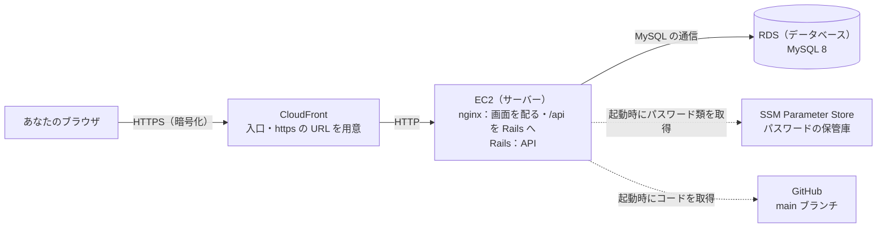
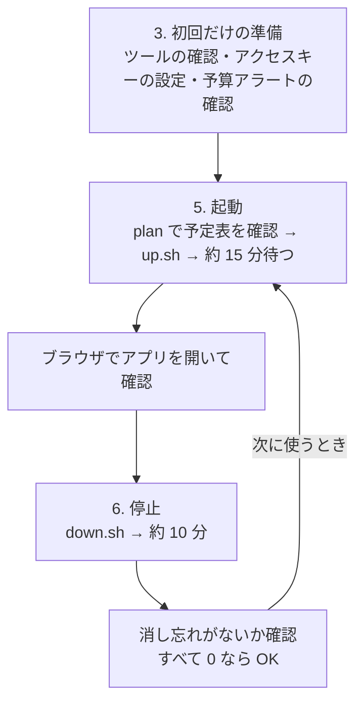

# 読書管理アプリ — AWS デプロイの手順書（はじめての人向け）

> この文書は、**プログラミング初学者・実務未経験で、AWS も Terraform も初めて**の人が、
> AWS のマネジメントコンソール（ブラウザの管理画面）を手で操作せずに、**AWS CLI と Terraform をコマンドで使い、AI（Claude Code）と一緒に**
> このアプリを AWS に公開（デプロイ）→ 確認 → 片付け できるようになるための手順書です。
>
> 設計の理由や費用の比較は [インフラ設計](infrastructure.md)、コマンドだけの早見表は [infra/README.md](../infra/README.md) にあります。

関連：[インフラ設計](infrastructure.md) / [infra/README.md](../infra/README.md) / [基本設計（図）](basic-design.md) / [要件定義書](requirements.md)

---

## 0. この手順書のゴール

- 自分のパソコンのターミナルからコマンドを打つだけで、このアプリを AWS 上に起動し、ブラウザで開けるようになる。
- 使い終わったらコマンド 1 つで AWS から削除し、**お金がかかり続けない状態に戻せる**ようになる。
- 途中で何が起きているかを、用語の意味から理解できるようになる。

| 項目 | 目安 |
|---|---|
| 初回だけの準備 | 30 分〜1 時間（この PC ではすでに済んでいるので、確認だけなら 5 分） |
| 起動（デプロイ） | コマンド実行から使えるようになるまで約 15 分 |
| 停止（片付け） | 約 10 分 |
| 費用 | 起動中は **1 時間あたり約 $0.06（約 9 円）**。停止中は DB の保存データ（スナップショット）の保管料だけで、月数円〜数十円（2026-09 時点の概算） |

> **いちばん大事なこと**：AWS は「使った分だけ払う」仕組みです。**起動したまま放っておくと、使っていなくてもお金がかかり続けます。** 確認が終わったら、必ず「6. 停止の手順」まで行ってください。

---

## 1. まず知っておくこと（用語と仕組み）

### 1.1 クラウドと AWS

- **クラウド**：自分でサーバー（24 時間動くパソコン）を買わずに、インターネットの向こうにある他社のコンピューターを「必要なときに、必要な分だけ借りる」仕組み。
- **AWS（Amazon Web Services）**：Amazon のクラウド。サーバー・データベース・ネットワークなどを部品（**サービス**）として貸してくれる。
- **リージョン**：AWS のデータセンターがある地域。このアプリは **東京リージョン（`ap-northeast-1`）** を使う。
- **従量課金**：部品を「起動していた時間」や「保存しているデータ量」に応じて料金がかかる。止めれば（削除すれば）かからない。

### 1.2 IAM（誰が AWS を操作してよいか）

**IAM（アイアム、Identity and Access Management）** は、AWS アカウントを「誰が」「何を」操作してよいかを決める仕組みです。

| 用語 | 意味 | このプロジェクトでは |
|---|---|---|
| **ルートユーザー** | AWS アカウントを作ったときのメールアドレスでログインする、何でもできる最強の利用者。お金の設定やアカウントの削除もできる | 普段は使わない。MFA を付けて金庫にしまうイメージ |
| **IAM ユーザー** | ルートユーザーが作る「普段使い用」の利用者。できることを制限できる | `administrator` という IAM ユーザーを使う |
| **MFA（多要素認証）** | パスワードに加えて、スマホのアプリに出る 6 桁の数字でも本人確認する仕組み | ルートユーザーと IAM ユーザーの両方に付ける |
| **ポリシー** | 「何をしてよいか」を書いた許可のリスト | `administrator` には `AdministratorAccess`（ほぼ何でもできる）が付いている。学習用に手早く進めるためで、実務では必要な操作だけに絞る |
| **アクセスキー** | コマンド（AWS CLI や Terraform）から AWS を操作するための「鍵」。**アクセスキー ID**（鍵の名前。`AKIA…` で始まる）と**シークレットアクセスキー**（鍵そのもの。パスワードに当たる）の 2 つで 1 組 | `administrator` のアクセスキーを使う |

> **アクセスキーは家の鍵と同じです。** 他人に渡すと、その人はあなたのお金で AWS を好きなだけ使えます。扱い方は「3.4 アクセスキーを守るルール」を必ず読んでください。

### 1.3 AWS CLI（コマンドで AWS を操作する道具）

- **AWS CLI** は、マネジメントコンソールでクリックしてやる操作を、ターミナルのコマンドでできるようにする道具です。
  - 例：「自分が誰として AWS にログインしているか」を見る → `aws sts get-caller-identity`
- AWS CLI は、次の 2 つのファイルに書かれた設定を読んで動きます（`aws configure` というコマンドで作られます）。

| ファイル | 書いてあるもの |
|---|---|
| `~/.aws/credentials` | アクセスキー ID とシークレットアクセスキー（**秘密**） |
| `~/.aws/config` | 使うリージョン（`ap-northeast-1`）と、結果の表示形式 |

`~` は自分のホームフォルダ（この PC なら `/Users/ada`）のことです。Terraform も同じファイルを読んで AWS を操作します。

### 1.4 IaC（Infrastructure as Code）

**IaC** は「インフラ（サーバーやネットワークなどの土台）を、**コードで書いて作る**」という考え方です。

| 手で作る（コンソールでクリック） | IaC（コードで作る） |
|---|---|
| 何をどう設定したか、後から分からなくなる | 設定がすべてファイルに残る |
| もう一度同じものを作るのが大変 | 同じコードから何度でも同じものが作れる |
| 消し忘れが起きやすい | コマンド 1 つで、作ったものを全部消せる |
| 変更の前に確認しにくい | 「何が変わるか」を実行前に見られる。Git で履歴やレビューもできる |

このプロジェクトでは「使うときだけ起動して、終わったら全部消す」運用なので、**毎回同じものを作り直せる IaC が特に向いています**。

### 1.5 Terraform（IaC の道具）

**Terraform** は、IaC を実現する代表的な道具です。`.tf` という拡張子のファイルに「こういう部品をこういう設定で作りたい」と書くと、Terraform が AWS に指示を出して、その通りに作ってくれます。

| 用語 | 意味 | このプロジェクトでは |
|---|---|---|
| **provider（プロバイダ）** | Terraform が「どのクラウドを操作するか」を決める部品 | `aws`（AWS を操作する）と `random`（パスワードなどを作る）。`infra/versions.tf` |
| **resource（リソース）** | 作りたい部品 1 つ 1 つ（サーバー 1 台、データベース 1 つ など） | 27 個（2026-09-28 時点）。`infra/*.tf` |
| **variable（変数）** | 作るときに変えられる値 | リージョン・サーバーの大きさなど。`infra/variables.tf` |
| **output（出力）** | 作った後に表示してほしい値 | アプリの URL など。`infra/outputs.tf` |
| **state（ステート）** | 「今 AWS に何を作ったか」を Terraform が覚えておくメモ。`infra/terraform.tfstate` というファイル | **消さない・コミットしない**。消すと Terraform が作ったものを覚えていられなくなり、削除できなくなる。パスワードなどの秘密も入っているので、Git には入れない（`.gitignore` 済み） |

Terraform の基本のコマンドは 4 つです。

| コマンド | すること | AWS に変化は？ |
|---|---|---|
| `terraform init` | 準備。provider をダウンロードする | なし |
| `terraform plan` | 「今の AWS」と「コードに書いた姿」を比べて、**何を作る・変える・消すかの予定表**を出す | なし（見るだけ） |
| `terraform apply` | 予定表を出して、`yes` と入力すると**実際に作る** | **あり（課金が始まる）** |
| `terraform destroy` | 作ったものを出して、`yes` と入力すると**全部消す** | **あり（課金が止まる）** |

`plan` の予定表では、各行の先頭の記号で何が起きるかが分かります。

| 記号 | 意味 |
|---|---|
| `+` | 新しく作る |
| `~` | 今あるものを変更する |
| `-` | 消す |
| `-/+` | 一度消して作り直す |

最後の行に `Plan: 27 to add, 0 to change, 0 to destroy.` のように、合計が出ます（27 個作る・0 個変える・0 個消す、という意味）。

### 1.6 このアプリの AWS 上の構成



| 部品（AWS のサービス） | 役割 | 書いてあるファイル |
|---|---|---|
| **VPC・サブネット** | AWS の中に作る自分専用のネットワーク。インターネットから入れる区画（パブリック）と入れない区画（プライベート）に分ける | `infra/network.tf` |
| **セキュリティグループ** | 部品ごとの「通してよい通信」のリスト（ファイアウォール）。EC2 には CloudFront からの通信だけ、RDS には EC2 からの通信だけを通す | `infra/security.tf` |
| **IAM ロール** | EC2 に「パスワードの保管庫を読んでよい」などの許可を与える | `infra/iam.tf` |
| **SSM Parameter Store** | DB のパスワード・管理者のパスワードなどの秘密を暗号化して保管する。Terraform がランダムに作って入れる | `infra/secrets.tf` |
| **EC2** | サーバー（仮想のパソコン）。起動すると GitHub の `main` からコードを取ってきて、アプリを組み立てて動かす | `infra/ec2.tf`、`infra/templates/` |
| **RDS** | データベース（MySQL）。インターネットからは直接つながらない区画に置く | `infra/rds.tf` |
| **CloudFront** | 入口。`https://xxxx.cloudfront.net` という URL を用意し、通信を暗号化する（独自ドメインを買わずに https にできる） | `infra/cloudfront.tf` |

**使うときだけ起動**：停止（destroy）するときに、データベースの中身を**スナップショット**（その時点の丸ごとのコピー）として保存し、次に起動するときにそこから元に戻します。これで、登録した本やユーザーは次回に引き継がれます。

---

## 2. 全体の流れ



以降のコマンドは、特に書いていなければ **Mac のターミナル**（または VS Code の「ターミナル」→「新しいターミナル」）で実行します。

---

## 3. 初回だけの準備（認証設定）

### 3.1 コンソールでしかできないこと（最初の 1 回だけ）

「コンソールを手で操作しない」が目標ですが、**次の 3 つだけは、最初の 1 回だけブラウザのコンソールでやる必要があります**。AWS CLI は「すでにある鍵」を使って動く道具なので、最初の鍵そのものはコマンドでは作れないためです。

1. AWS アカウントを作る（ルートユーザーができる）。
2. ルートユーザーに MFA を付け、IAM ユーザー（`administrator`）を作って MFA を付ける。
3. `administrator` のアクセスキーを 1 組発行する（「コマンドラインインターフェイス（CLI）」用を選ぶ）。

> **ルートユーザーのアクセスキーは絶対に作らないでください。** 漏れると、アカウントごと乗っ取られます。

**この PC ではすでに済んでいます**（2026-09-28 に確認：`administrator` として認証でき、予算アラートも設定済み）。次の 3.2・3.3 で「確認するだけ」で大丈夫です。新しい PC で始めるときは、3.3 の `aws configure` から行います。

### 3.2 ツールが入っているか確認する

AWS CLI のバージョンを表示します。

```bash
aws --version
```

→ `aws-cli/2.` で始まる文字が出れば OK（この PC では `aws-cli/2.35.4`）。

Terraform のバージョンを表示します。

```bash
terraform version
```

→ `Terraform v1.10` 以上が出れば OK（この PC では `v1.15.6`）。

入っていない場合は、Homebrew（Mac 用のソフトを入れる道具）で入れます。

```bash
brew install awscli
```

```bash
brew install hashicorp/tap/terraform
```

### 3.3 アクセスキーを設定・確認する

**新しく設定するとき**（この PC では済んでいるので不要）は、次を実行し、聞かれた 4 項目を入力します。

```bash
aws configure
```

| 聞かれる項目 | 入力するもの |
|---|---|
| `AWS Access Key ID` | 発行したアクセスキー ID（`AKIA…`） |
| `AWS Secret Access Key` | 発行したシークレットアクセスキー |
| `Default region name` | `ap-northeast-1` |
| `Default output format` | `json`（何も入れず Enter でも可） |

> `aws configure` は、**必ず自分のターミナルで**実行してください。AI（Claude Code）に実行を頼んだり、キーを AI のチャットに貼ったりしないでください（3.4）。

**設定できているか確認する**（ここは AI に頼んでも大丈夫です）。

```bash
aws sts get-caller-identity
```

→ 次のように出れば OK です。

```json
{
    "UserId": "AIDA…",
    "Account": "123456789012",
    "Arn": "arn:aws:iam::123456789012:user/administrator"
}
```

- `Account`：あなたの AWS アカウントの番号（12 桁）。
- `Arn`：「どのアカウントの、どの利用者か」を表す住所のようなもの。最後が `user/administrator` なら、IAM ユーザー `administrator` として操作できています。**`root` と出たら、ルートユーザーの鍵を使っているので危険です**（すぐに止めて、IAM ユーザーの鍵に替えてください）。

今の設定の中身（キーは最後の 4 文字だけ表示されます）を見るには：

```bash
aws configure list
```

### 3.4 アクセスキーを守るルール

| やってはいけないこと | 理由 |
|---|---|
| Git にコミットする・GitHub に上げる | 公開リポジトリのキーは、数分で自動的に見つけられて悪用される |
| AI のチャット・Slack・メールに貼る | 相手のサーバーに残る |
| 画面共有・スクリーンショットに映す | 見た人が使えてしまう |
| ルートユーザーのキーを作る | 漏れたときの被害がアカウント全体に及ぶ |

**定期的に作り直す**（90 日に 1 回くらいが目安。漏れたかもと思ったら、すぐ）：鍵を新しくして、古い鍵を使えなくします。1 人の IAM ユーザーが持てるアクセスキーは 2 組までです。

以下は**すべて自分のターミナルで**実行します（新しいキーの秘密が画面に出るため、AI には頼みません）。

① 今あるキーを確認します。

```bash
aws iam list-access-keys --user-name administrator
```

→ `AccessKeyId`（キーの名前）と `CreateDate`（作った日）が出ます。今使っているキーの `AccessKeyId` をメモしておきます（これが「古いキー」になります）。

② 新しいキーを作ります。

```bash
aws iam create-access-key --user-name administrator
```

→ `AccessKeyId` と `SecretAccessKey` が出ます。**`SecretAccessKey` はこのとき 1 回しか表示されません。**

③ 新しいキーに入れ替えます（②で出た 2 つを入力。リージョンと形式はそのまま Enter）。

```bash
aws configure
```

④ 新しいキーで動くか確認します（`user/administrator` が出れば OK）。

```bash
aws sts get-caller-identity
```

⑤ 古いキーを使えなくします。`AKIAOLDKEYEXAMPLE` の部分は、①でメモした古いキーの `AccessKeyId` に置き換えてください。

```bash
aws iam update-access-key --user-name administrator --access-key-id AKIAOLDKEYEXAMPLE --status Inactive
```

⑥ 数日たって困ることがなければ、古いキーを削除します（⑤と同じく置き換え）。

```bash
aws iam delete-access-key --user-name administrator --access-key-id AKIAOLDKEYEXAMPLE
```

### 3.5 予算アラートを確認する

**予算アラート（AWS Budgets）** は、「1 日（1 か月）の料金がこの金額を超えそうになったらメールで知らせる」設定です。消し忘れに気付くための命綱です。

```bash
aws budgets describe-budgets --account-id "$(aws sts get-caller-identity --query Account --output text)" --query 'Budgets[].[BudgetName,TimeUnit,BudgetLimit.Amount]' --output table
```

→ `Daily-Cost-Alert`（1 日 0.5 ドル）と `Monthly-Cost-Alert`（1 か月 12 ドル）が出れば OK です（2026-09-28 に確認済み）。起動中は 1 時間に約 $0.06 かかるので、**8 時間ほど起動したままにすると 1 日のアラートが届きます**。

---

## 4. AI（Claude Code）と一緒に進める方法

### 4.1 役割分担

AI はコマンドを実行したり結果を読み解いたりするのが得意です。一方で、**お金がかかり始める・止まる操作と、秘密（キーやパスワード）を扱う操作は、あなた自身が行います**。

| 操作 | 誰が | 理由 |
|---|---|---|
| 認証の確認（`aws sts get-caller-identity`）・予算アラートの確認 | AI | 見るだけで、秘密も出ない |
| `terraform init` / `validate` / `plan` と、その予定表の説明 | AI | AWS は変わらない（見るだけ） |
| **起動（`infra/scripts/up.sh`）** | **あなた** | 課金が始まる。途中で `yes` の入力が要る |
| 起動後の確認（`/up` が 200 になるまで見る・構築ログを見る） | AI | 見るだけ |
| **管理者パスワードの表示** | **あなた** | 秘密をチャットに残さない |
| **停止（`infra/scripts/down.sh`）** | **あなた** | データを消す操作。途中で `yes` の入力が要る |
| 消し忘れの確認・トラブルの調査 | AI | 見るだけ |
| **アクセスキーの設定・作り直し（`aws configure`・`create-access-key`）** | **あなた** | 鍵の秘密が画面に出る |

`up.sh` と `down.sh` は、途中で Terraform が予定表を表示して「本当に実行しますか？」と聞いてきます。**その予定表を自分の目で確かめて `yes` と打つこと**が、「何が作られる（消される）か分かった上で実行する」ための大事な確認です。AI に代わりに `yes` を入れさせないでください。

### 4.2 Claude Code の「許可」の画面

Claude Code は、コマンドを実行する前に「このコマンドを実行してよいか」を聞いてきます。

- `aws sts …`・`aws … describe-…`・`aws … list-…`・`terraform plan`・`curl` などの**見るだけのコマンド**は、許可して大丈夫です。
- `apply`・`destroy`・`delete`・`create`・`update`・`iam` が含まれるコマンドは、**何をするコマンドか説明してもらってから**判断してください。分からなければ「このコマンドは何をするの？」と聞いてかまいません。

### 4.3 そのまま使える頼み方の例

```text
AWS の認証が今使えるか確認して
```

```text
infra の terraform plan を取って、何が作られるか初心者向けに説明して
```

```text
up.sh を実行したので、アプリが使えるようになるまで /up を確認して
```

```text
/up が 502 のままなので、EC2 の構築ログを見て原因を調べて
```

```text
down.sh が終わったので、AWS に課金中のリソースが残っていないか確認して
```

---

## 5. 起動（デプロイ）の手順

### 5.1 起動の前に確認すること

EC2 は起動するときに **GitHub の `main` ブランチ**からコードを取ってきます。公開したい変更が `main` にマージ済みか確かめます。

```bash
cd /Users/ada/RaiseTech/reading-board
```

```bash
git checkout main
```

```bash
git pull origin main
```

```bash
git log --oneline -1
```

→ 最後にマージした PR が 1 行目に出れば OK です。

認証が使えるか確認します（3.3 と同じ。`user/administrator` が出れば OK）。

```bash
aws sts get-caller-identity
```

### 5.2 予定表（plan）を見る

Terraform の準備をします（初回や、久しぶりに使うときだけ。何度やっても害はありません）。

```bash
terraform -chdir=/Users/ada/RaiseTech/reading-board/infra init
```

→ `Terraform has been successfully initialized!` が出れば OK。

`-chdir=` は「このフォルダで実行して」という意味です（`cd` しなくても `infra` の中で実行したことになります）。

予定表を出します（AWS は何も変わりません）。

```bash
terraform -chdir=/Users/ada/RaiseTech/reading-board/infra plan
```

→ 最後に `Plan: 27 to add, 0 to change, 0 to destroy.` と出れば、「何もない状態から 27 個作る」予定です（数は infra/ のコードを変えると変わります）。予定表は長いので、AI に「この plan を説明して」と頼むと、何が作られるかを読み解いてくれます。

> この `plan` は「新しい DB を作る」予定になります。実際の起動（`up.sh`）では、前回のスナップショットがあればそこから DB を復元するように、自動で指定が追加されます。

### 5.3 起動する（あなたが実行）

```bash
/Users/ada/RaiseTech/reading-board/infra/scripts/up.sh
```

1. `スナップショット … から DB を復元します` または `スナップショットなし：新しい DB を作ります` と出ます。
2. 予定表が表示され、最後に `Do you want to perform these actions?` と聞かれます。
3. 予定表の最後の行が `Plan: 27 to add, 0 to change, 0 to destroy.` であることを確かめて、`yes` と入力して Enter。
4. 約 10 分で `Apply complete! Resources: 27 added, 0 changed, 0 destroyed.` と出ます（CloudFront の作成に 3〜4 分かかります）。**ここから課金が始まっています。**

### 5.4 使えるようになるまで待つ

`Apply complete!` の後も、EC2 の中でアプリを組み立てるのに**さらに約 5 分**かかります。その間にアプリの URL を開くと `502` や `504`（まだ準備中）になります。

使えるようになったか確認します（AI に「/up を確認して」と頼んでも大丈夫です）。

```bash
curl -s -o /dev/null -w '%{http_code}\n' "$(terraform -chdir=/Users/ada/RaiseTech/reading-board/infra output -raw app_url)/up"
```

→ `200` と出れば完成です。`502` / `504` ならもう少し待ってから再実行します。10 分以上 `502` が続くときは「8. うまくいかないとき」へ。

> `/up` は「サーバーが動いているか」だけを見る場所で、宛先名の確認（`config.hosts`）の対象外です。`/up` が `200` でも、アプリ本体が使えるとは限りません。ブラウザでログインできるか（5.5）まで確かめます。

### 5.5 ブラウザで開いてログインする

アプリの URL を表示します。

```bash
terraform -chdir=/Users/ada/RaiseTech/reading-board/infra output -raw app_url
```

→ `https://xxxxxxxxxxxxx.cloudfront.net` のような URL が出るので、ブラウザで開きます。

ログインするメールアドレスを表示します（既定は `admin@example.com`）。

```bash
terraform -chdir=/Users/ada/RaiseTech/reading-board/infra output -raw admin_email
```

管理者のパスワードは**あなたが**表示します（AI には頼みません）。まず、パスワードを表示するためのコマンドを出します。

```bash
terraform -chdir=/Users/ada/RaiseTech/reading-board/infra output -raw admin_password_command
```

→ `aws ssm get-parameter --region ap-northeast-1 --name /reading-board/admin_password --with-decryption …` のような 1 行のコマンドが出ます。**その 1 行をそのままコピーしてターミナルに貼って実行**すると、パスワードが表示されます。

- 管理者のパスワードは**起動のたびに新しくなります**。毎回この手順で確認してください。
- 管理者以外のユーザー（招待で登録した人）のパスワードは、前回のまま引き継がれます。

### 5.6 書影（表紙画像）の鍵を登録する（最初の 1 回だけ）

本番でも表紙を出すには、Google Books の API キーを **SSM Parameter Store**（秘密の値の保管庫）に 1 回だけ登録します。登録しなくてもアプリは動きます（表紙が出ないだけ）。**AWS を止めても消えない**ので、2 回目からは不要です。

1. 鍵を画面に出さずに読み込みます（`鍵を貼り付けて Enter` と出たら、Google Cloud の「認証情報」でコピーした鍵を貼り付けて Enter）。

```bash
read -s "GOOGLE_BOOKS_API_KEY?鍵を貼り付けて Enter（画面には表示されません）: " && export GOOGLE_BOOKS_API_KEY && echo "" && echo "読み込みました（${#GOOGLE_BOOKS_API_KEY} 文字）"
```

2. 登録します（`Version: 1` のように出れば OK）。

```bash
aws ssm put-parameter --region ap-northeast-1 --name /reading-board/google_books_api_key --type SecureString --value "$GOOGLE_BOOKS_API_KEY"
```

3. 次に起動（5.3）したときから使われます。起動済みなら、いったん止めて起動し直します。

---

## 6. 停止（片付け）の手順

### 6.1 停止する（あなたが実行）

```bash
/Users/ada/RaiseTech/reading-board/infra/scripts/down.sh
```

1. 削除の予定表が表示され、最後に `Do you really want to destroy all resources?` と聞かれます。
2. 予定表の最後の行が `Plan: 0 to add, 0 to change, 27 to destroy.` であることを確かめて、`yes` と入力して Enter。
3. 約 10 分で `Destroy complete! Resources: 27 destroyed.` と出ます。
4. 続けてスナップショット（DB の保存データ）の完成を待ち、古いスナップショットを削除して、`完了：データはスナップショット … に保存されています` と出れば終わりです。

### 6.2 消し忘れがないか確認する

AI に「課金中のリソースが残っていないか確認して」と頼むか、次の 4 つを実行します。

```bash
aws ec2 describe-instances --query 'length(Reservations[].Instances[?State.Name!=`terminated`][])'
```

```bash
aws rds describe-db-instances --query 'length(DBInstances)'
```

```bash
aws ec2 describe-addresses --query 'length(Addresses)'
```

```bash
aws cloudfront list-distributions --query 'DistributionList.Quantity'
```

→ 4 つとも `0`（CloudFront は `null` と出ることがあり、これも「1 つも無い」の意味）なら OK です。DB のスナップショットが 1 つ残るのは正常です（次回の起動で使います）。SSM Parameter Store に `/reading-board/google_books_api_key`（書影の鍵。自分で登録したもの）が 1 つ残るのも正常です（無料。消さない）。

---

## 7. アプリを更新したとき

EC2 は**起動するときに** GitHub の `main` を取ってくるので、起動中に `main` を更新しても、AWS 上のアプリは変わりません。

1. 変更を PR でマージして、`main` を最新にする（5.1）。
2. 起動中なら、いったん停止する（6.1）。
3. もう一度起動する（5.3）。DB はスナップショットから戻るので、データは残ります。

マージ前のブランチを試したいときは、`infra/terraform.tfvars`（自分で作るファイル。Git には入りません）に次の 1 行を書いてから起動します。試し終わったらこの行を消してください。

```hcl
git_ref = "feature/xx-branch-name"
```

（ファイルを作らずに、起動のコマンドの前に `TF_VAR_git_ref=ブランチ名` を付けても同じです。例：`TF_VAR_git_ref=chore/161-production-config-hosts infra/scripts/up.sh`）

**安全のための設定（`config.hosts` など）を変えたとき**は、「使える」ことに加えて「**断るべきものが断られる**」ことまで確かめます。AI に「知らない宛先名で 403 になるか、EC2 の中から確かめて」と頼んでください（#161 では、正しい宛先名 → `401`（通過）、`Host: evil.example.com` → `403` を確認しました）。

---

## 8. うまくいかないとき

| 表示・症状 | よくある原因 | どうするか |
|---|---|---|
| `InvalidClientTokenId` / `SignatureDoesNotMatch` | アクセスキーが間違っている・削除された | `aws configure list` で最後の 4 文字を確認し、正しいキーを `aws configure` で入れ直す（3.3） |
| `AccessDenied` / `UnauthorizedOperation` | その操作の許可（ポリシー）が無い | `aws sts get-caller-identity` で `user/administrator` か確認。別の利用者になっていれば設定を直す |
| `ExpiredToken` | 期限付きの鍵（一時的な認証情報）が切れた | このプロジェクトの設定では通常出ない。出たら、環境変数 `AWS_SESSION_TOKEN` などが残っていないか AI に調べてもらう |
| `/up` が 10 分以上 `502` / `504` のまま | EC2 の中でアプリの組み立てに失敗している | AI に「EC2 の構築ログを見て」と頼む（[infra/README.md](../infra/README.md) の「構築ログの確認」のコマンドを使う） |
| アプリを開くと `Blocked hosts` / `403` と出る、または `/up` だけ `200` でログインできない | 本番の Rails が「知らない宛先名」として断っている（`config.hosts`）。`APP_HOSTS` に EC2 の名前が入っていない | AI に「EC2 の APP_HOSTS と構築ログを見て」と頼む（構築ログに `APP_HOSTS=ec2-…` が出ているか確認する。[infrastructure.md](infrastructure.md) §1.1） |
| `Error acquiring the state lock` | 前の Terraform が途中で止まり、「実行中」の印が残った | 他のターミナルで Terraform が動いていないか確認し、AI に相談する（印を無理に外すと state が壊れることがある） |
| `up.sh` / `down.sh` が途中でエラーになった | 通信の途切れ・AWS 側の一時的な問題 | **もう一度同じコマンドを実行する**。Terraform は state を見て、残りの分だけ作る（消す） |
| 予算アラートのメールが来た・停止を忘れた | 起動したままになっている | すぐに `down.sh`（6.1）→ 消し忘れ確認（6.2） |

---

## 9. 安全と費用のチェックリスト

**起動する前**

- [ ] 公開したい変更が `main` にマージ済み
- [ ] `aws sts get-caller-identity` が `user/administrator`（`root` ではない）
- [ ] 予定表が `27 to add` になっている
- [ ] 確認が終わったら停止する時間を決めた

**停止した後**

- [ ] `Destroy complete! Resources: 27 destroyed.` が出た
- [ ] 消し忘れ確認の 4 つがすべて `0`（または `null`）
- [ ] `infra/terraform.tfstate` は消していない・コミットしていない

**いつも**

- [ ] アクセスキーをチャット・Git・画面共有に出していない
- [ ] ルートユーザーのアクセスキーを作っていない
- [ ] 90 日くらいでアクセスキーを作り直している

---

## 10. 用語集

| 用語 | 意味 |
|---|---|
| AWS | Amazon のクラウド。サーバーやデータベースなどを時間・量に応じて借りられる |
| リージョン | AWS のデータセンターがある地域。東京は `ap-northeast-1` |
| マネジメントコンソール | AWS をブラウザで操作する管理画面 |
| IAM | AWS を誰が何をしてよいかを決める仕組み |
| ルートユーザー | AWS アカウントを作ったときの、何でもできる利用者。普段は使わない |
| IAM ユーザー | 普段使い用の利用者。このプロジェクトでは `administrator` |
| MFA | パスワードに加えて、スマホのアプリの数字でも本人確認する仕組み |
| ポリシー | 何をしてよいかを書いた許可のリスト |
| アクセスキー | コマンドから AWS を操作するための鍵。ID とシークレットの 2 つで 1 組 |
| ARN | AWS の中の住所のような名前（例：`arn:aws:iam::123456789012:user/administrator`） |
| AWS CLI | AWS をコマンドで操作する道具 |
| IaC | インフラをコードで書いて作る考え方 |
| Terraform | IaC の道具。`.tf` ファイルの通りに AWS の部品を作る・消す |
| provider | Terraform がどのクラウドを操作するかを決める部品 |
| resource | Terraform で作る部品 1 つ 1 つ |
| state（tfstate） | Terraform が「何を作ったか」を覚えておくファイル。消さない・コミットしない |
| plan / apply / destroy | 予定表を出す / 作る / 全部消す |
| VPC・サブネット | AWS の中の自分専用のネットワークと、その区画 |
| セキュリティグループ | 部品ごとの「通してよい通信」のリスト |
| EC2 | AWS の仮想サーバー |
| RDS | AWS のデータベース（ここでは MySQL） |
| CloudFront | 入口となる配信の仕組み。https の URL を用意する |
| SSM Parameter Store | パスワードなどの秘密を暗号化して保管する場所 |
| スナップショット | ある時点のデータベースの丸ごとのコピー |
| AWS Budgets | 料金が決めた金額を超えそうになったら知らせる仕組み |
| デプロイ | 作ったアプリを、他の人も使える場所（ここでは AWS）に置いて動かすこと |
