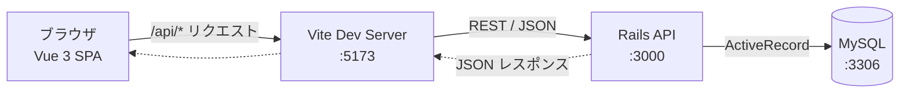
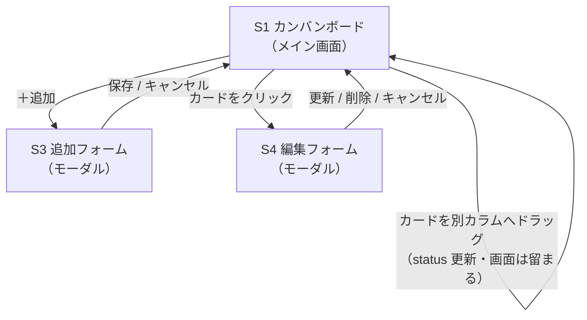
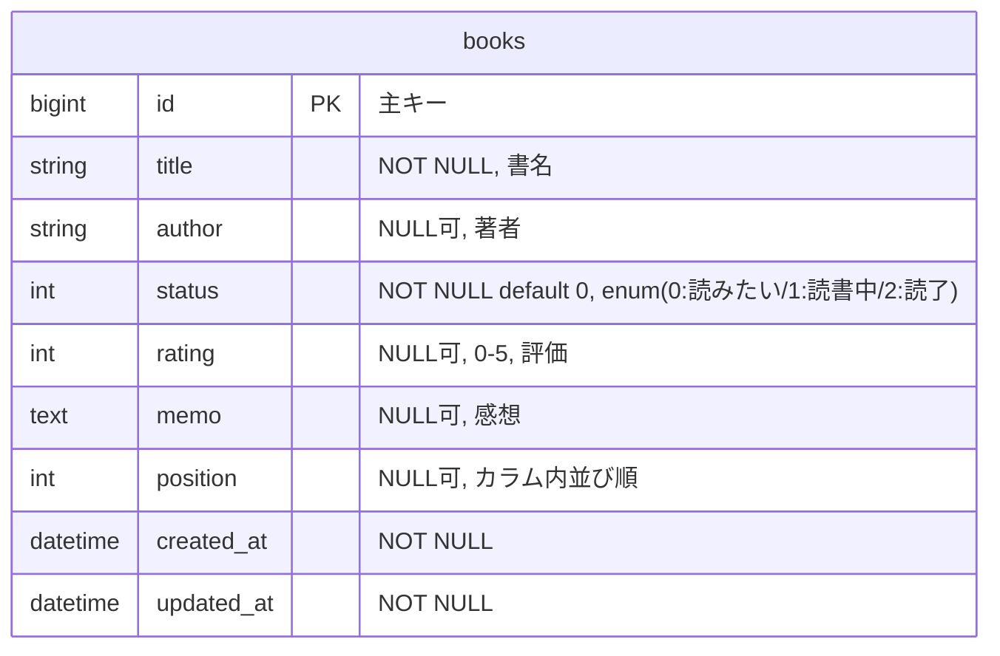
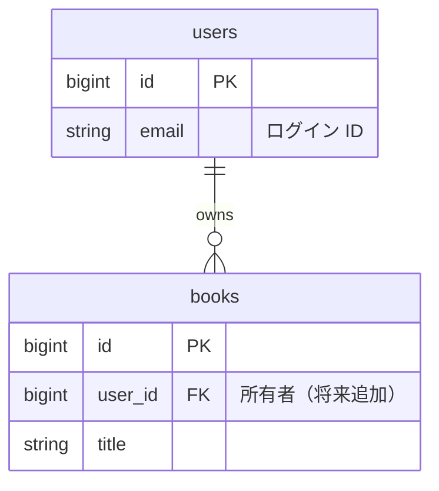
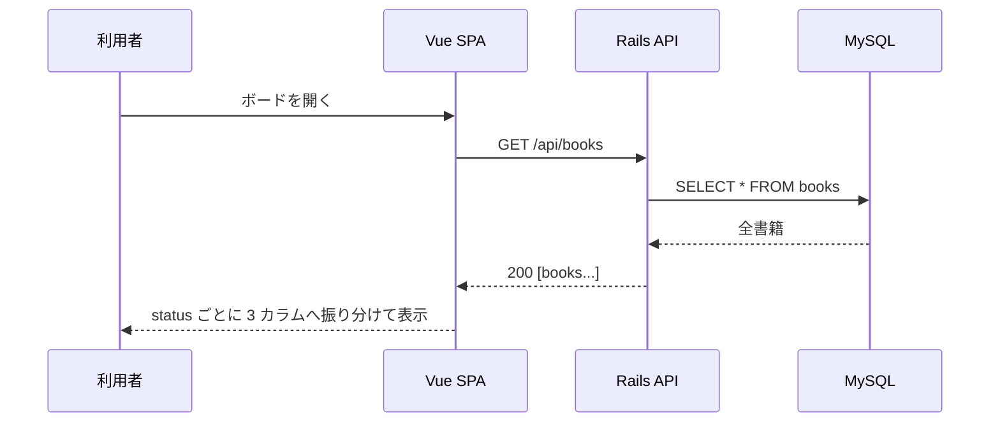
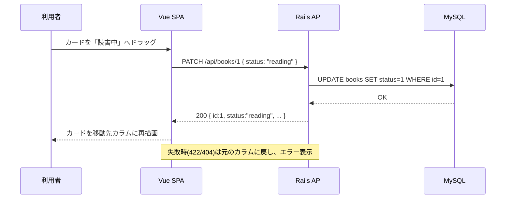

# 読書管理アプリ — 基本設計（画面遷移・ER・データフロー）

[要件定義書（概要）](requirements.md) と各詳細ドキュメントを土台に、実装に向けた **How** を図で整理する。
図は GitHub 上で描画される [Mermaid](https://mermaid.js.org/) 記法で記述している。

対応関係：[機能要件](functional-requirements.md)（ユースフロー・API）・[画面設計](screen-design.md)（画面仕様）・
[データベース設計](database-design.md)（データモデル）を、本書で「遷移／構造／流れ」の観点から図示する。

---

## 1. システム構成

フロント（Vue SPA）は Vite の開発プロキシ経由で Rails API を呼び、Rails は ActiveRecord で MySQL にアクセスする。
ポートは固定（[CLAUDE.md](../CLAUDE.md) §8）。

- フロントは `/api/*` を叩くだけで、プロキシが `http://localhost:3000` に転送する（CORS/ポート差異を吸収）。
- 本番構成では Vite プロキシの代わりに Web サーバ/リバースプロキシが同じ役割を担う想定。

---

## 2. 画面遷移図

画面は [画面設計](screen-design.md) の S1〜S4。ボードを中心に、追加/編集はモーダルで開いて閉じると戻る。

- 画面遷移の実体は 1 画面（SPA）で、S3/S4 はモーダルの開閉。
- カード移動はページ遷移せず、その場で状態更新して再描画する。

---

## 3. ER 図

現状のエンティティは `books` の 1 テーブル（[schema.rb](../backend/db/schema.rb) に準拠）。

### 3.1 将来の拡張（認証導入時）

[要件定義書](requirements.md) §4（将来拡張候補）の通り、将来的に単一ユーザー認証を追加する場合は `users` を追加し、
`books` に `user_id` を持たせて 1 対多で紐づける想定（本フェーズでは未実装）。

---

## 4. データフロー

### 4.1 一覧表示（画面初期化）

### 4.2 カード移動＝ステータス変更（カンバンの中心操作）

### 4.3 登録 / 編集 / 削除

| 操作 | 画面 | API | DB |
|---|---|---|---|
| 登録 | S3 追加フォーム | POST /api/books | INSERT |
| 編集（評価・メモ含む） | S4 編集フォーム | PATCH /api/books/:id | UPDATE |
| 削除 | S4 編集フォーム | DELETE /api/books/:id | DELETE |

---

## 5. 画面の構成要素と対応 API

各画面（[画面設計](screen-design.md)）が使う API・データの対応。

| 画面/要素 | 主な構成要素 | 使う API | 備考 |
|---|---|---|---|
| S1 カンバンボード | 3 カラム（件数付き見出し）、カードリスト、追加ボタン | GET /api/books | status で 3 カラムに振り分け |
| S2 書籍カード | タイトル・著者・★、ドラッグ操作 | PATCH /api/books/:id | ドラッグで status 更新 |
| S3 追加フォーム | タイトル(必須)・著者・初期ステータス、保存/キャンセル | POST /api/books | 成功で該当カラムに追加 |
| S4 編集フォーム | 全項目入力、更新/削除/キャンセル | PATCH・DELETE /api/books/:id | 削除は確認の上 |

---

## 6. フロントの状態管理方針（概要）

- ボードは取得した書籍配列を保持し、`status` でグルーピングして 3 カラムに描画する。
- カード移動・登録・編集・削除の後は、レスポンスを反映してカラム表示を更新する（楽観的更新＋失敗時ロールバックも可）。
- API クライアントは `/api` を基点に CRUD をまとめる（実装ステップは [要件定義書](requirements.md) §5-4 で作成）。

> 詳細なバリデーション仕様・コンポーネント分割・状態管理ライブラリの要否は、
> 各実装ステップ（[要件定義書](requirements.md) §5 実装の分割方針）で詰める。
