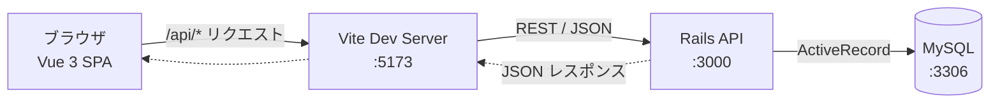
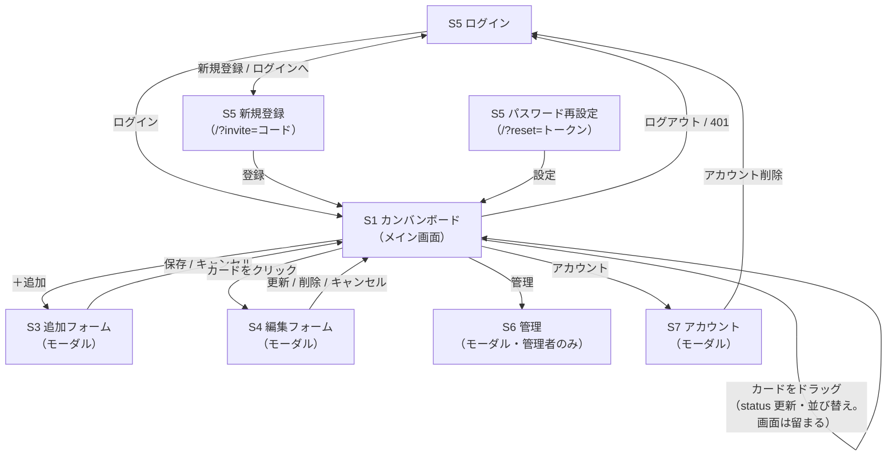
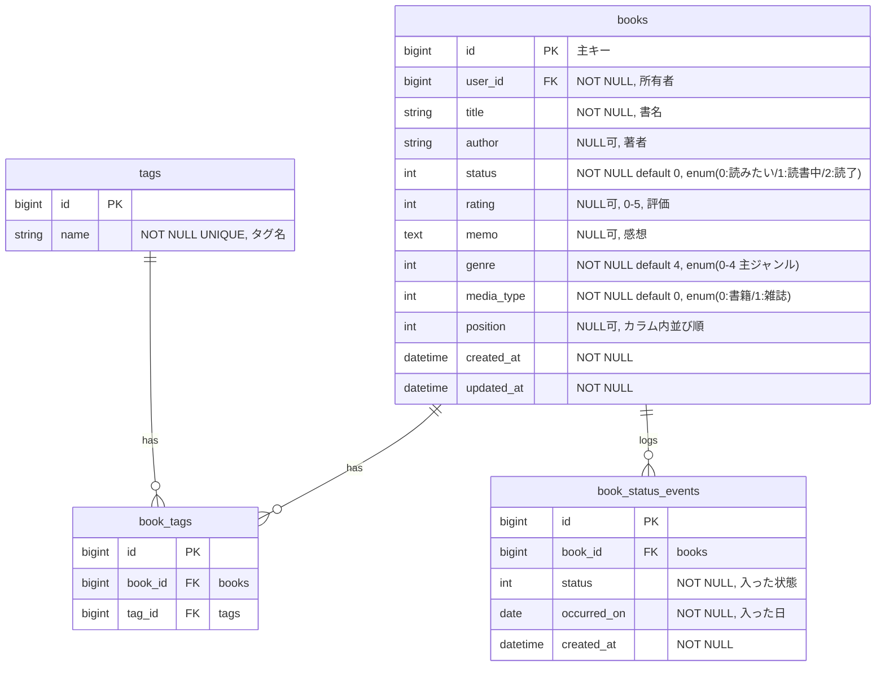
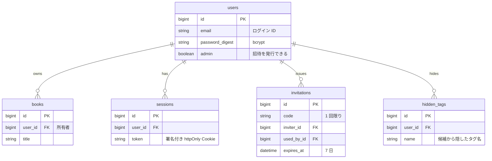
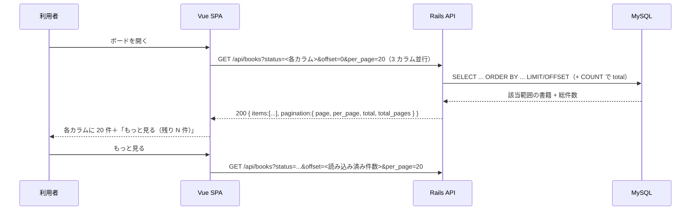
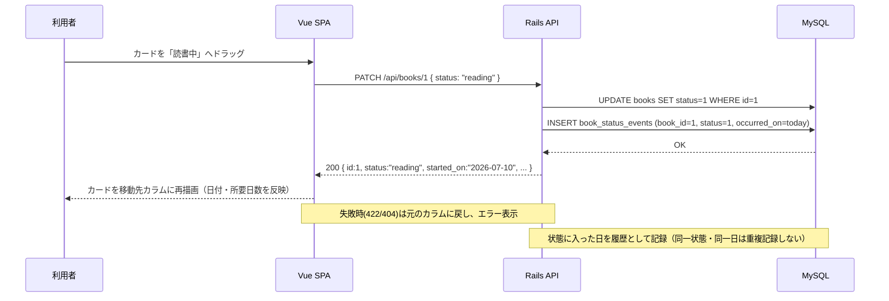
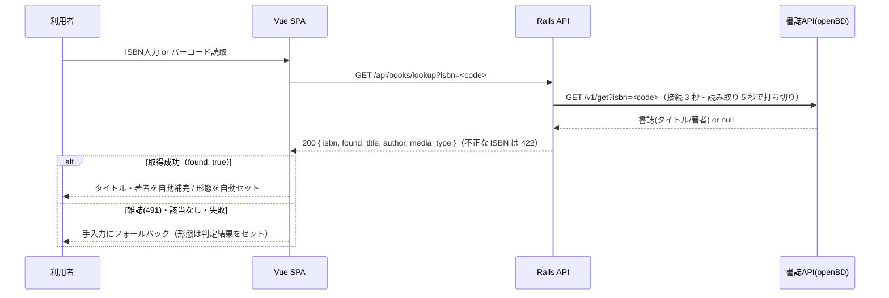

# 読書管理アプリ — 基本設計（画面遷移・ER・データフロー）

[要件定義書（概要）](requirements.md) と各詳細ドキュメントを土台に、実装に向けた **How** を図で整理する。
図は GitHub 上で描画される [Mermaid](https://mermaid.js.org/) 記法で記述している。

対応関係：[機能要件](functional-requirements.md)（ユースフロー・API）・[画面設計](screen-design.md)（画面仕様）・
[データベース設計](database-design.md)（データモデル）を、本書で「遷移／構造／流れ」の観点から図示する。

---

## 1. システム構成

フロント（Vue SPA）は Vite の開発プロキシ経由で Rails API を呼び、Rails は ActiveRecord で MySQL にアクセスする。
ポートは固定（[CLAUDE.md](../CLAUDE.md) §8）。

- フロントは `/api/*` を叩くだけで、プロキシが `http://localhost:3000` に転送する（CORS/ポート差異を吸収）。
- 本番（AWS、[インフラ設計](infrastructure.md)）では EC2 上の **nginx** が同じ役割を担う（SPA を配信し、`/api` と `/up` を Rails コンテナへ転送）。HTTPS は CloudFront で終端する。

---

## 2. 画面遷移図

画面は [画面設計](screen-design.md) の S1〜S7。未ログインならログイン画面（S5）、ログイン後はボード（S1）を中心に、各機能はモーダルで開いて閉じると戻る。

- 画面遷移の実体は 1 画面（SPA）で、`App.vue` がログイン状態と URL の `?invite=` / `?reset=` を見て S5 / S1 を切り替える（vue-router は未使用。導入は #158）。S3・S4・S6・S7 はモーダルの開閉。
- カード移動はページ遷移せず、その場で状態更新して再描画する。

---

## 3. ER 図

`books` を中心に、タグ（多対多）と状態イベント（日付履歴）を持つ（[データベース設計](database-design.md) に準拠）。

- 所要日数（開始→読了）は `book_status_events` から算出し、保存しない。ISBN は照会（lookup）にだけ使い、保存しない。
- `books` は `user_id` で所有者（`users`）に紐づく（認証は実装済み。§3.1）。

### 3.1 認証（招待制の複数ユーザー・実装済み）

認証を**セッション Cookie 方式**で実装済み。`users` / `sessions` / `invitations`（[データベース設計](database-design.md) §7）を持ち、`books` は `user_id` で所有者に 1 対多で紐づく。公開サインアップは無く、初期ユーザー（管理者）は seed で作成し、他のユーザーは管理者が発行した招待コードで登録する（[複数ユーザー対応](multi-user.md)）。

- ログインで `sessions` を作成し `token` を署名付き httpOnly Cookie（`session_token`, SameSite=Lax。本番は secure）に保持。フロントは同一オリジン（開発は Vite プロキシ、本番は nginx）なので Cookie が自動送受信される。
- 全 `/api/books*` は認証必須で `current_user` にスコープ。**未認証は 401**（フロントはログイン画面へ）。

---

## 4. データフロー

### 4.1 一覧表示（画面初期化）

- 一覧はページング対応（`page` 既定1・下限1、`per_page` 既定100・1〜200 にクランプ）。`offset`（0 以上）を指定すると `page` より優先。レスポンスは `{ items, pagination }` エンベロープ。
- 並びは既定 `position IS NULL, position, created_at, id`。`sort`（`finished_on` / `registered_on` / `rating` / `duration_days`）＋`dir`（`asc`/`desc`）で並び替え（値が無い本は末尾、同値はタイトル順。position は使わない）。不正な `sort` は無視。
- カンバンは**カラム（status）ごとに個別取得**し、初期 20 件・「もっと見る」で追加読込（`useKanbanColumns`）。件数表示は `total`。
  - 追加読込は **`offset` = 読み込み済み件数**。D&D でカードが移るとページ境界がずれるため、page 番号ではなく offset で取りこぼしを防ぐ（重複は id で除外）。
  - 読了カラムの並び替えはページをまたいで正しくなるよう**サーバー側**（`sort`/`dir`）で行い、変更時は先頭から取り直す。
  - 読了カラムはキーで並べるため**カラム内の手動並び替えの対象外**。他カラムからドロップしたときは status だけ更新し、読了カラムを取り直してキー順の位置に置く（reorder は呼ばない）。
  - 絞り込み変更時は各カラムを先頭 20 件に戻す。追加・編集・削除後は読み込み済み件数を保って取り直す（上限 200）。
- タグ選択肢の収集のみ全ページを集約する（`listAllBooks`）。

### 4.2 カード移動＝ステータス変更（カンバンの中心操作）

### 4.3 登録 / 編集 / 削除

| 操作 | 画面 | API | DB |
|---|---|---|---|
| 登録 | S3 追加フォーム | POST /api/books（種別・タグ含む） | INSERT（+ book_tags / status_event） |
| 編集（評価・メモ・種別・タグ含む） | S4 編集フォーム | PATCH /api/books/:id | UPDATE（+ book_tags 同期） |
| 削除 | S4 編集フォーム | DELETE /api/books/:id | DELETE |
| 一覧絞り込み | S1 ヘッダ | GET /api/books?status=&genre=&author=&tag=&sort=&dir=&page=\|offset=&per_page= | SELECT（AND 条件・ORDER BY・LIMIT/OFFSET） |
| カラム内並び替え | S1 カラム（D&D） | PATCH /api/books/reorder { ids:[...] } | UPDATE position（渡した id を 0..n-1、同じ status の残りは既存順で n.. に詰める・1 クエリ） |
| ログイン | ログイン画面 | POST /api/session { email, password } | sessions INSERT ＋ 署名付き httpOnly Cookie 発行（IP ごとに 3 分 10 回まで、超過は 429） |
| ログアウト | ヘッダ | DELETE /api/session | sessions DELETE ＋ Cookie 削除 |
| ログイン状態確認 | 画面初期化 | GET /api/session | 現在の current_user（`id` / `email` / `admin`）を返す（未認証 401） |
| 招待コードで登録 | 登録画面 | POST /api/registration { invitation_code, email, password, password_confirmation } | users INSERT ＋ invitations UPDATE（行ロック・使用済みに）＋ sessions INSERT。コード不正・メール重複・パスワード不備は 422 |
| ユーザー一覧 | 管理 → ユーザータブ（管理者のみ） | GET /api/users | users SELECT（`id` / `email` / `admin` / `created_at`）。一般ユーザーは 403 |
| 再設定リンクの発行 | 管理 → ユーザータブ（管理者のみ） | POST /api/users/:user_id/password_reset_link | 署名付きトークン（`has_secure_password` の reset token・24 時間・DB 非保存）を返す |
| 再設定リンクの確認 | 再設定画面を開いた時 | GET /api/password_reset?token= | 使えれば `{ email }`、無効・期限切れ・使用済みは 422（フォームを出さない）。3 分 30 回まで |
| パスワード再設定 | 再設定画面（`/?reset=TOKEN`） | PATCH /api/password_reset { token, password, password_confirmation } | users UPDATE ＋ そのユーザーの sessions 全 DELETE ＋ sessions INSERT（この端末でログイン）。無効・期限切れ・使用済みは 422。3 分 10 回まで |
| タグ候補を隠す / 戻す | S3・S4 のタグ候補（× / 「隠した候補」） | GET / POST /api/hidden_tags、DELETE /api/hidden_tags/:id | hidden_tags SELECT / INSERT / DELETE（ユーザーごと。本のタグは変えない） |
| アカウント削除 | ヘッダ「アカウント」→ アカウント削除タブ | DELETE /api/registration { current_password } | users DELETE（books・sessions・発行した invitations も削除、使った invitations の used_by_id は NULL）＋ Cookie 削除。パスワード違い・最後の管理者は 422。3 分 10 回まで |
| 招待の一覧 / 発行 / 削除 | 管理 → 招待タブ（管理者のみ） | GET / POST /api/invitations、DELETE /api/invitations/:id | invitations SELECT / INSERT / DELETE（未使用のみ）。一般ユーザーは 403 |
| パスワード変更 | ヘッダ「アカウント」→ パスワード変更タブ | PATCH /api/password { current_password, password, password_confirmation } | users UPDATE（8 文字以上）＋ 自分以外の sessions DELETE（他端末は失効・操作中は維持）。不備は 422 |

### 4.4 ISBN/バーコードから登録

---

## 5. 画面の構成要素と対応 API

各画面（[画面設計](screen-design.md)）が使う API・データの対応。

| 画面/要素 | 主な構成要素 | 使う API | 備考 |
|---|---|---|---|
| S1 カンバンボード | 3 カラム（件数付き見出し）、カードリスト、追加ボタン、絞り込み（著者/ジャンル/タグ）、読了の並び替え、カラム内 D&D 並び替え | GET /api/books?status=&genre=&author=&tag=&sort=&dir=&offset=&per_page=、PATCH /api/books/reorder | 絞り込みは AND。カラムごとにページング（20 件＋もっと見る）。読了のキー並び替えはサーバー側、カラム内の手動順は position に保存 |
| S2 書籍カード | ジャンル/雑誌バッジ、タイトル・著者・★・タグ・日付・所要日数、ドラッグ操作 | PATCH /api/books/:id | ドラッグで status 更新＋状態イベント記録。カラム内ドロップは position 更新 |
| S3 追加フォーム | ISBN/バーコード登録、タイトル(必須)・著者・ステータス・ジャンル・形態・評価・メモ・タグ・タグ提案、保存/キャンセル | GET /api/books/lookup、POST /api/books | 成功で該当カラムに追加 |
| S4 編集フォーム | 全項目入力（種別・タグ含む）、更新/削除/キャンセル | PATCH・DELETE /api/books/:id | 削除は確認の上 |
| S5 ログイン / 新規登録 / 再設定 | 各フォーム | /api/session、/api/registration、/api/password_reset | §4.3 |
| S6 管理 | 招待タブ・ユーザータブ | /api/invitations、/api/users、/api/users/:id/password_reset_link | 管理者のみ |
| S7 アカウント | パスワード変更・アカウント削除タブ | /api/password、DELETE /api/registration | |

---

## 6. フロントの状態管理方針（概要）

- ボードの書籍は composable `useKanbanColumns`（`frontend/src/composables/`）がカラム（status）ごとに保持する（§4.1）。状態管理ライブラリ（Pinia 等）は使わない。
- カード移動は**楽観的更新**（先に画面を動かし、API 失敗時はサーバーから取り直して元に戻す）。登録・編集・削除の後は読み込み済み件数を保って取り直す。
- ログイン中のユーザーは `App.vue` が保持し、props でボードへ渡す。API が 401 を返したらログイン画面へ戻す。
- API クライアントは `frontend/src/api/`（`http.ts` の `request` を基点に、books / session / registration / invitations / users / password / passwordReset）。エラーは `{ errors: [...] }` を `ApiError` に変換する。
