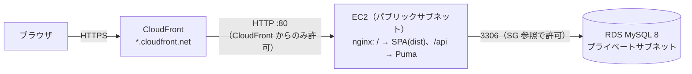

# 読書管理アプリ — インフラ設計（AWS デプロイ案）

> **ステータス：構築中。** 決定事項は §0。アプリ側の本番設定は済（§1.1）、`infra/`（Terraform）は作成中。
> AWS 上のリソース・課金はまだゼロ。`terraform apply` は実行前に必ず合意を取る。
> 費用は 2026-09 時点の東京リージョン・オンデマンド料金の**概算**（1 USD ≒ 150 円）。着手時に公式の料金ページで必ず再確認する。

関連：[基本設計](basic-design.md) §1（システム構成）/ [技術スタック](tech-stack.md) / [複数ユーザー対応](multi-user.md)

---

## 0. 決定事項（2026-09-24）

| 項目 | 決定 |
|---|---|
| 構成 | **B：EC2 ＋ RDS ＋ CloudFront**（§2） |
| 運用 | **使うときだけ起動**：学習・動作確認のときに `terraform apply`、終わったら `terraform destroy`（常時公開しない） |
| ドメイン | **取らない**（`*.cloudfront.net` の URL で HTTPS）。SES（メール）はドメインを取るときに |
| 予算アラート | **既存のまま**（AWS Budgets に日次 $0.5・月次 $12 が設定済み。Terraform では作らない） |

---

## 1. 前提（アプリ側の制約）

どの構成でも満たす必要がある、現状の実装から来る条件。

| 条件 | 理由 |
|---|---|
| **フロントと API を同一オリジン**で配信（`/` → SPA、`/api/*` → Rails） | 認証はセッション Cookie（SameSite=Lax・httpOnly）で、フロントは相対パス `/api` を叩く。開発では Vite プロキシが担っている役割（[基本設計](basic-design.md) §1） |
| **HTTPS** 必須 | 本番は Cookie に `secure` を付ける（Rails `force_ssl` / `assume_ssl`）。要件 §3.7 |
| MySQL 8 | ActiveRecord の MySQL 前提（`DATEDIFF` 等の方言も使用） |
| Rails 8 の実行環境 | `backend/Dockerfile`（Rails 8 標準）あり。Kamal / Thruster の gem も同梱済み（未設定） |
| シークレット | `RAILS_MASTER_KEY`・DB パスワードはコード / `.tf` / ドキュメントに書かない |

### 1.1 アプリ側の本番設定（済）

- `database.yml` の production は単一 DB。接続先は環境変数 `DB_HOST` / `DB_PORT` / `DB_USERNAME` / `DB_PASSWORD` / `DB_NAME` で渡す（Rails 既定の cache / queue / cable DB は未使用のため削除）。
- `production.rb`：`assume_ssl` ＋ `force_ssl`（Cookie は secure・HSTS 付き。CloudFront→EC2 は HTTP でもリダイレクトはループしない）。`/up` はリダイレクト対象外。
- 秘密鍵は **`SECRET_KEY_BASE` 環境変数**で渡す（`master.key` はサーバーに置かない）。
- `backend/Dockerfile`（Rails 8 標準）のコンテナは起動時に `db:prepare`（DB 作成・マイグレーション・新規 DB なら seed）。**本番の seed は `SEED_USER_EMAIL` / `SEED_USER_PASSWORD` が必須**（未指定なら停止し、開発用の既定パスワードで管理者を作らない）。
- 手元の Docker で本番モードの起動・ログイン（secure Cookie・HSTS）・seed のガードを確認済み。

---

## 2. 構成案の比較

| | A. EC2 単体 | **B. EC2 ＋ RDS ＋ CloudFront（推奨）** | C. ALB ＋ EC2 ＋ RDS ＋ S3 |
|---|---|---|---|
| 概要 | 1 台に nginx（SPA 配信＋`/api` 転送）・Rails・MySQL（Docker） | EC2 に nginx＋Rails、DB は RDS（プライベートサブネット）。CloudFront で HTTPS 終端 | ALB で HTTPS 終端・ルーティング、SPA は S3、DB は RDS |
| HTTPS | 独自ドメイン＋Let's Encrypt が必要 | **ドメイン不要**（`*.cloudfront.net` の証明書） | 独自ドメイン＋ACM が必要 |
| DB の扱い | インスタンス内（バックアップ自前） | マネージド（自動バックアップ） | マネージド |
| 月額概算（常時起動） | 約 $12〜20（2,000〜3,000 円） | 約 $30〜40（4,500〜6,000 円） | 約 $50〜60（7,500〜9,000 円） |
| 学習価値 | 低（ほぼローカルと同じ） | 中〜高（VPC / SG / RDS / CDN） | 高（定番の 3 層構成） |
| 懸念 | DB とアプリが同居・スケール不可 | CloudFront の `/api` キャッシュ無効化設定が要る | ドメイン費用・ALB の固定費 |

**推奨は B**：品質チェックリスト（DB はプライベート・`publicly_accessible = false`）を満たしつつ、ドメイン購入なしで HTTPS と同一オリジンを両立できる。C へは後から ALB を足して移行できる。

### 2.1 構成 B の図

- CloudFront：`/api/*` はキャッシュ無効（Cookie・クエリ・`Authorization` をオリジンへ転送）、それ以外は SPA の静的配信をキャッシュ。
- EC2 の SG：80 番は **CloudFront のマネージドプレフィックスリストのみ**許可。SSH は使わず **SSM Session Manager** で接続（22 番を開けない）。
- RDS：シングル AZ・最小クラス。**NAT Gateway は作らない**（約 $45/月の固定費になるため。EC2 はパブリックサブネットに置く）。
- Rails：`config.assume_ssl = true`＋`force_ssl`（CloudFront で TLS 終端するため）。シークレットは **SSM Parameter Store（SecureString）** から起動時に注入。

### 2.2 構成 B の費用内訳（概算・月額）

| リソース | 想定 | 概算 |
|---|---|---|
| EC2 | t4g.small（Arm）＋ gp3 20GB | 約 $18 |
| パブリック IPv4 | 1 個 | 約 $4 |
| RDS | db.t4g.micro シングル AZ ＋ 20GB | 約 $15〜20 |
| CloudFront | 個人利用の転送量（無料枠内の想定） | ほぼ $0 |
| SSM Parameter Store | 標準パラメータ | $0 |
| **合計** | | **約 $30〜40** |

- 無料枠の扱いは**アカウント作成時期で異なる**（2025 年 7 月以降の新規アカウントはクレジット制）。着手時に自分のアカウントで確認する。
- 使うときだけ `terraform apply`、終わったら `terraform destroy` すれば、数時間の検証なら数十円〜数百円に収まる。

---

## 3. コスト管理（着手時に最初にやること）

1. **AWS Budgets** で月額予算アラート（例：$10 / $30 で通知）を最初に作る（Budgets は 2 件まで無料）。
2. 学習中は**常時起動しない**。`terraform destroy` を README に明記し、終了時に必ず実行する。
3. RDS は停止しても 7 日で自動起動するため、長期間使わないなら destroy（必要ならスナップショットを残す）。
4. NAT Gateway・Elastic IP の放置・マルチ AZ など、固定費の大きい設定は使わない。

---

## 4. Terraform 方針

- 置き場所：`infra/`（リポジトリ直下）。`*.tfstate` / `terraform.tfvars` は `.gitignore` 済み。
- state：最初はローカル（1 人運用）。複数環境・CI 連携が必要になったら S3 backend に移す。
- ファイル分割：`providers.tf` / `variables.tf` / `network.tf`（VPC・サブネット・SG）/ `ec2.tf` / `rds.tf` / `cloudfront.tf` / `outputs.tf`。
- 機密変数は `sensitive = true`。DB パスワードは tfvars か `random_password` → SSM に保存。
- CI：PR で `terraform fmt -check` と `terraform validate` のみ（`plan` / `apply` は手元で実行し、CI に AWS 認証情報は置かない）。
- 点検項目は quality-review スキルの「4. Terraform / インフラ」を正とする。

---

## 5. デプロイ手順（案）

1. `frontend`：`npm run build` → `dist/` を EC2 の nginx 配信ディレクトリへ転送。
2. `backend`：Docker イメージ（`backend/Dockerfile`）を EC2 上で起動（Kamal か docker compose で管理。着手時に決める）。
3. `bin/rails db:migrate` → 初期ユーザーを seed（`SEED_USER_EMAIL` / `SEED_USER_PASSWORD` を本番用に指定）。

---

## 6. 着手前に決めること

- [ ] 構成案（推奨：B）
- [ ] 月額予算の上限と Budgets の通知額
- [ ] 独自ドメインの要否（不要なら B のまま。必要なら Route 53＋ACM を追加）
- [ ] 常時公開するか、学習時のみ apply / destroy するか
- [ ] 複数ユーザー対応を先にやるか（公開するならサインアップ・レート制限が要る。[複数ユーザー対応](multi-user.md)）
